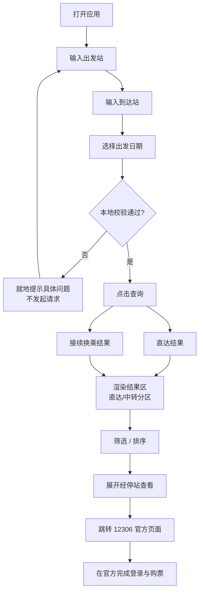
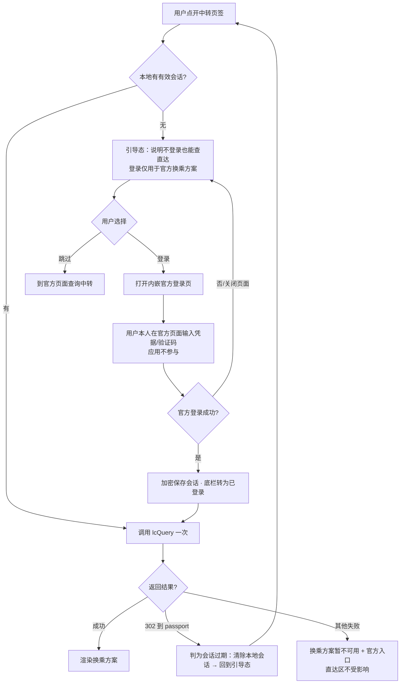

# 列车线路查询应用 需求文档

| 项 | 值 |
|---|---|
| 文档编号 | PRD-001 |
| 版本 | v2.4 |
| 更新日期 | 2026-10-09 |
| 适用范围 | V1（首个可分发版本） |
| 关联文档 | [AGENTS.md](../AGENTS.md)、[外部接口与合规规范](../规范/外部接口与合规规范.md)、[测试与验收规范](../规范/测试与验收规范.md) |
| 阻塞项 | **无**。原 Q-04（经停站接口形态）与 Q-10（余票权威列）已于 v2.3 用实测数据关闭；余下 Q-02/Q-03/Q-07/Q-08/Q-12/Q-13 均非阻塞 |

> **v2.0 变更要点**（原因见第十五、十六节）：① 范围决策 D-03 由"完全不登录"改为"允许内嵌官方登录页、应用永不接触凭据"，因为实测官方接续换乘接口在游客态被重定向到登录页，不登录就拿不到官方中转方案；② FR-06 由"调官方中转接口"改写为"登录态下调 `lcQuery`，失败降级为跳转官方"；③ 新增 FR-24 官方登录态管理、FR-25 登录状态可见与一键清除；④ FR-05 的解析约束按实测响应改正；⑤ 新增 NFR-13 凭据隔离、NFR-14 WebView2 运行时可用性。

---

## 一、背景与问题定义

### 要解决的实际问题

想从 A 城到 B 城，需要知道"有哪些车、几点发、几点到、多久、还有没有票、多少钱、要不要换乘"。官方渠道能回答这些问题，但在桌面场景下有三个具体摩擦：

| 摩擦 | 具体表现 | 本应用怎么消除 |
|---|---|---|
| 操作路径长 | 打开浏览器 → 过首页跳转 → 点"火车票" → 输入 → 选日期 → 翻页 | 桌面常驻，打开即可输入，一次点击出结果 |
| 信息密度低 | 网页列表夹杂广告与引导位，一屏能看到的车次少 | 纯结果列表，行高紧凑，一屏可见车次翻倍 |
| 比对困难 | 想按"最快"或"最便宜"重排、想看某站是不是经停、想横向比两趟车，都要反复切换页面 | 本地筛选/排序瞬时完成；经停站就地展开；常用线路一键重查 |

### 为什么现在值得做

亲友有真实的查询需求（回家、探亲），而官方页面在低带宽、非技术用户、老电脑上体验尤其差。一个只做查询的本地小工具，成本可控且价值直接。

---

## 二、目标与非目标

### V1 目标

1. 输入两个站名和一个日期，**同时**拿到直达车次和官方接续换乘方案。
2. 结果可筛选（车型、时段、席别、只看有票）、可重排（最快、最早、最便宜）。
3. 任一车次可就地展开经停站时刻表。
4. 常用线路可收藏，重启后仍在，一键重查。
5. 分发摩擦为零：双击 `exe` 即用，不要求对方装任何运行环境。

### V1 不做清单

| 不做的功能 | 为什么不做 |
|---|---|
| **自实现**账号密码登录、验证码识别/代填、直连官方登录接口 | 密码只要经过程序代码，风险就从"某个 IP 被查多了"升级为"亲友账号被风控 + 密码交给非官方程序"，且这段代码是所有抢票工具的共同前奏。登录本身允许，但**只允许**用户在 WebView2 里的官方页面上自己输入（FR-24） |
| 读取/展示任何登录后才可见的个人数据（订单、常旅客、账号资料） | 登录的唯一目的是换取中转与经停的查询数据。多读一个字段，就把"只读查询工具"变成"代管他人账号"，责任不可承受 |
| 购票、选座、候补、支付 | 应用定位是"看懂数据"，不是"替人操作"；交易动作留在官方完成，责任边界清晰 |
| **（v2.2）为"多买几站"提供任何自动下单、锁票、占位、一键购长票** | 该功能的产物恰好是"多花钱但有票的方案列表"，离"替你买"只差一个按钮。这个按钮一旦存在，应用性质就从查询工具变成购票代理，AGENTS.md 第五节红线立即触发。**只读边界必须在功能最有价值的地方守得最紧** |
| **（v2.2）对中转方案的两段分别做区间扩展** | 两段各自扩展会使请求数变成乘积级（最多 10 × 10），与任何可接受的频率约束都无法调和。只对直达车次开放扩展 |
| 余票自动监控与到票提醒 | 唯一必须引入高频轮询的功能，直接抵触 SPEC-007 频率红线；且它把工具性质推向"抢票辅助"。**列为 V2 候选首位**，届时先修订频率规范 |
| 自行计算中转换乘（本地枢纽两段子查询拼接） | 该方案曾在实测发现 `lcQuery` 需登录后作为替代被评估。最终未采纳：登录态下官方 `lcQuery` 可用，其方案质量（换乘站选择、同站/异站判定、候车时长约束）优于本地拼接，且不必为一个更差的结果多花 2 次请求与一张枢纽表。**保留为降级路径**：用户不登录时，中转区给出跳转官方而非本地拼接 |
| 多设备同步、云端服务、用户体系 | 分发对象是亲友，无任何协作场景；引入服务端会同时带来运维、隐私与接口暴露成本 |
| 导出/分享行程（PDF、图片） | 没有明确的使用者诉求，纯推测性功能（YAGNI） |
| 汽车票、机票、多式联运 | 超出 12306 数据边界 |
| 命令行模式、快捷键工作流、脚本接口 | 使用者为非技术亲友 |
| 多语言 | 使用者全部为中文母语者 |

---

## 三、目标用户与使用画像

| 维度 | 描述 |
|---|---|
| 规模 | 5–20 人，你本人 + 亲友 |
| 技术能力 | 会用微信、浏览器，不会装 Python / 不会配环境变量 / 不会看命令行 |
| 设备 | Windows 10 或 Windows 11，x64，普通家用机，可能是机械硬盘 |
| 网络 | 家庭宽带，可能不稳；春节等高峰时段官方响应偏慢 |
| 使用频率 | 低频但刚需：每次要出门前查 1–5 次，一旦需要就是连续比对多趟车 |
| 核心诉求 | 快、看得懂、别出错、别逼我登录 |

**关键推论**（决定了几条硬需求）：
- 低频 + 刚需 ⇒ 每次打开都要"零学习成本"，不能依赖说明书 → NFR-10。
- 非技术使用者 ⇒ 出错时必须给人话提示，且**发新版本比远程技术支持便宜得多** → NFR-04。
- 亲友机器不可控 ⇒ 必须自包含、必须实测干净账户 → NFR-02。

---

## 四、用户故事

| 编号 | 作为 | 我想要 | 以便 | 优先级 |
|---|---|---|---|---|
| US-01 | 出行者 | 输入出发地和目的地的站名（打几个字就联想出来） | 不用记三字码、不用翻省市级联 | P0 |
| US-02 | 出行者 | 选定出发日期，且超出可售范围的日期直接不可选 | 不会白跑一次查询 | P0 |
| US-03 | 出行者 | 一次查询同时看到直达和中转方案 | 不用去另一个入口再查一遍 | P0 |
| US-04 | 出行者 | 只看高铁动车、只看上午、只看有二等座 | 从几十条结果里迅速缩到两三条 | P0 |
| US-05 | 出行者 | 按"最快/最早出发/最便宜"一键重排 | 直接看到最优选 | P0 |
| US-06 | 出行者 | 点开某趟车看它中途停哪些站、几点到 | 判断上下车是否方便、能否错峰 | P1 |
| US-07 | 探亲常客 | 把"北京→济南"存成常用线路，下次一键查 | 每次回家不用重新输入 | P1 |
| US-08 | 谨慎的买家 | 挑中某趟车后一键跳到官方页面 | 在官方完成登录与付款，我不在这里交易 | P0 |
| US-09 | 非技术用户 | 查询失败时看到明确的中文原因和下一步建议 | 不用截图来问你"这是啥意思" | P0 |

---

## 五、业务流程

### BF-01 主流程：查询并选定方案



### BF-02 异常流程：查询失败

| 失败类型 | 判定 | 应用行为 | 用户下一步 |
|---|---|---|---|
| 本机无网络 | 连接/DNS/TLS 层失败 | 结果区显示"网络连接不上，请检查本机网络" + `重试` 按钮 | 检查网络后点重试 |
| 官方返回异常结构 | 非 JSON / HTML 提示页 / 被引导到验证码 | 显示"官方查询接口暂时不可用，请稍后再试"，**不显示重试刷屏，不发第二次请求** | 等待几分钟 |
| 接口字段变化 | 映射表缺失或解析抛错 | 显示"官方数据格式变更，本版本可能无法查询，请获取新版工具"；同时写本地日志 | 联系你更新版本 |
| 查询无结果 | 正常响应但车次为空 | 空状态插画 + "该日期无直达车次"，若中转有结果则保留展示 | 换日期/看中转 |
| 登录会话缺失或过期 | 需要登录的接口返回 302 到 `passport` | **引导态**（不是错误态）：说明不登录也能查直达、登录只用于换乘方案 + `登录` 按钮；同时清除本地失效会话 | 自行决定是否登录，或改用官方页面 |
| 超时 | 超过 15 秒（硬性上限，见 NFR-01） | 取消在途请求，显示"官方响应较慢，查询已超时" + `重试` | 重试或稍后 |

判定顺序**必须**是"本地校验 → 网络层 → 结构层 → 业务层"，不允许把结构解析失败笼统报成"网络错误"——那是最坏的情况，因为用户会反复重试而问题永远不会自愈。

### BF-03 子流程：站点码表缺失

启动时若本地无码表且内置码表加载失败：**禁止**让查询按钮进入"能点但必失败"状态。应禁用查询并在设置页给出"更新站点数据"入口，说明更新需要什么条件（一次网络访问）。

### BF-04 子流程：收藏与重查

从收藏点击一条线路 → 条件回填（OD 保留，日期默认取今天）→ 用户确认日期 → 走 BF-01。**不得**在点击收藏的瞬间自动发起官方请求，理由见 FR-07 的节流约束。

### BF-05 子流程：跨零点夜车

到达时刻早于发车时刻时，结果行**必须**显式标注"次日"，历时按 +24h 计算。数据模型层用显式字段表达，不靠界面推断（SPEC-004 第六节第 5 条）。

### BF-06 子流程：登录与中转引导（v2.0 新增）



三条不可省略的分支：**会话过期不静默重登**（回到引导态由用户决定）、**失败不影响直达**、**应用全程不参与凭据**。

### BF-07 子流程：清除登录状态（v2.0 新增）

底栏状态或设置页点击"清除登录状态" → 二次确认（说明"清除后中转查询需重新登录"）→ 同时清 WebView 容器 Cookie 与本地加密副本 → 底栏回到"未登录" → 中转页签回到引导态。任一处残留即判为失败，不允许"清了一半"。

---

## 六、功能需求

优先级定义：**P0** = 无此功能则 V1 不成立；**P1** = V1 应有，可在极端排期下推迟到 1.1；**P2** = V1 可选，默认不做。

### 6.1 输入与查询准备

#### FR-01 站点模糊输入与联想（P0）

| 项 | 内容 |
|---|---|
| 描述 | 出发站与到达站输入框支持中文站名与拼音首字母模糊匹配，输入 ≥ 1 个字符即在 300 毫秒（目标值）内给出候选下拉，选中后写入站名与三字码 |
| 匹配范围 | 站名全串、站名前缀、站名包含、拼音全拼、拼音首字母（如 `bjn` → 北京南） |
| 候选排序 | 精确前缀匹配 > 包含匹配 > 拼音匹配；同级按车站等级/常用度排序 |
| 边界 | 同城多站（北京/北京南/北京西）全部列出，不得合并成"北京"造成歧义 |
| 异常 | 无任何候选时提示"未找到该车站，可能未被收录，试试站名中的一个字或上级市名" |
| 验收标准 | ① 输入"北京"出现不少于 4 个北京地区车站候选；② 输入"bjn"命中"北京南"；③ 用键盘上下键可选可回车；④ 未收录站名给出上述引导文案 |

#### FR-02 出发/到达互换（P0）

一键交换两站。验收：点击后 OD 互换，日期与筛选条件保持不变；结果区清空但不弹错误。

#### FR-03 日期选择（P0）

| 项 | 内容 |
|---|---|
| 描述 | 提供日期选择控件，可选范围严格限制在官方预售期内 |
| 默认值 | 今天 |
| 快捷项 | "今天 / 明天 / 后天" 三个快捷按钮；星期标注可见 |
| 范围约束 | 下界 = 今天，上界 = 今天 + 预售期天数 |
| 验收标准 | ① 范围内的日期可选，范围外置灰不可点；② 选择昨天在程序层面被拒绝而非仅 UI 置灰（双重防护）；③ 界面上可见当前预售期提示 |

> ⚠️ **待核实（Q-02）**：官方预售期当前口径（近年调整频繁）。核实方式：设计阶段用真实查询验证最早可查与最晚可查日期；在核实前，预售期天数**必须**做成配置项而非硬编码常量，以便不改代码即可修正。

#### FR-04 输入校验与本地拦截（P0）

进入网络层之前必须完成全部校验，任一不通过则就地提示、**不发起请求**：

| 校验项 | 不通过时 |
|---|---|
| 出发站已选定且有三字码 | 输入框标红 + "请选择出发车站" |
| 到达站同上 | 同上 |
| 出发站 ≠ 到达站 | "出发站与到达站不能相同" |
| 日期在范围内 | "所选日期不在可售范围内" |
| 距上次查询 ≥ 3 秒 | "稍等几秒再查询"（见 FR-07） |
| 码表可用 | "站点数据缺失，请到设置中更新" |

验收：构造上述 6 种非法输入，**官方请求发出次数为 0**（可用日志或断网验证）。

### 6.2 查询执行

#### FR-05 直达车次查询（P0）

| 项 | 内容 |
|---|---|
| 描述 | 按 日期 + 出发站三字码 + 到达站三字码 查询直达车次，返回该车次的发到时刻、历时、各席别余票与票价、列车类型 |
| 数据来源 | `API-02`（实测形态见 SPEC-007 第二节：`leftTicket/query` 302 → `queryG`，响应为 58 列竖线分隔字符串，**无字段映射表**） |
| 路径处理 | **必须**按 302 响应的 `Location` 引导发现真实路径后缀并缓存，**禁止**把某次观测到的后缀写成永久常量 |
| 解析约束 | 列下标**必须**收敛到单一版本化列布局描述表；解析前**必须**做三项结构自检（列数 == 预期、车次号格式、时刻格式），自检不过判为 `ParseFailure` 并**停止出数**，禁止"猜着往下解析"或渲染部分字段 |
| 结果字段 | 车次号、发时、到时、历时、出发/到达站、各席别余票与票价、是否可网上购票、**放票时间**（实测已在响应内，无需额外接口）、静音车厢等附加标记（若可得） |
| 验收标准 | ① 对同一 OD 的查询结果条数与官方页面一致；② 任一车次的发到时刻、历时与官方页面一致；③ 余票为 `无`/空/未知表示时统一显示"—"且计入"无票"；④ 喂入"列数减少"或"时刻列被改成非 `HH:mm`"的异常样本时，解析器必须抛 `ParseFailure` 而不是返回字段错位的对象；⑤ 票价解码有测试覆盖（`9174400000` → `1744.00` 元）；⑥ 未登记的席别码原样透传且不抛异常 |

#### FR-06 接续换乘方案查询（P0，依赖 FR-24 登录态）

| 项 | 内容 |
|---|---|
| 前置事实 | 实测 `lcQuery/query` 在游客态返回 **302 → `/otn/passport?redirect=…`**，即官方要求登录。因此本功能的可用性以 FR-24 为前提 |
| 描述 | 在已有官方登录会话的前提下，查询官方推荐的接续换乘方案，展示为"第一段车次 → 换乘站（候车时长）→ 第二段车次" |
| 数据来源 | `API-03` |
| 必要计算 | 两段之间的换乘候车时长 = 第二段发车时刻 − 第一段到达时刻；跨零点与跨日均需正确处理 |
| 过滤规则 | 候车时长为负（时间重叠）的方案**必须**丢弃并写日志（正常情况下官方不会给出，出现即说明解析有误，是自检信号）；同站换乘与异站换乘需在界面上区分标注 |
| 请求预算 | 与直达查询同属一个用户动作，合计**不得超过 3 次**官方请求；`lcQuery` 只允许调用 **1 次**，**禁止**逐段补查余票 |
| 降级（三级，按顺序生效） | ① 未登录 → 中转区显示"查看官方换乘方案需要登录" + `登录` 按钮 + `到官方页面查询` 链接，**不报错、不弹异常**；② 已登录但接口失败 → 显示"换乘方案暂不可用" + 官方页面链接；③ 中转失败而直达成功 → **不得**让整次查询失败，直达结果正常展示 |
| 验收标准 | ① 未登录时进入中转页签看到的是引导态而非错误态；② 登录后对一个有换乘可能的 OD 能看到至少一条方案（若官方有）；③ 每条方案的候车时长与两段时间自洽；④ 中转失败时直达区不受影响；⑤ 单动作实测请求数 ≤ 3 |

> ⚠️ **待核实（Q-01 已部分回答）**：`lcQuery` 在登录态下返回的方案是否已含两段完整余票与票价。核实前提是拿到登录会话，属实现阶段第一轮动作。若答案为"仅给候选组合"，按上表请求预算的约束，V1 的处理是**只展示班次与时间、余票标注为需点入查看**，而不是逐段自动补查——这条不依赖核实结果，已经定了。

#### FR-07 节流与并发控制（P0）

| 约束 | 数值 |
|---|---|
| 同一时刻在途官方请求 | **1**（含区间扩展，不因批量而放开） |
| 单用户动作触发的官方请求数 — **基础查询** | 目标 1，上限 3（直达 + 中转 + 会话初始化） |
| 单用户动作触发的官方请求数 — **区间扩展（v2.2）** | **默认上限 10，硬上限 12**；候选超出预算时只做优先级最高的前 N 个并明示"还有 M 个未查询"。详见 SPEC-007 v1.3 第四节 |
| 两次查询最小间隔 | 3 秒（硬性下限，**扩展批次内同样适用，不得为压缩耗时而缩短**） |
| 自动/后台请求 | 0（V1 无任何定时器发起官方请求） |
| 重试 | 仅 `NetworkUnavailable` 允许 1 次；`UpstreamRejected`/`ParseFailure` 0 次。**扩展批次一旦遇到 `UpstreamRejected` 立即整体中止**，不跳过该候选继续下一个（否则等于在风控面前持续撞） |
| 日请求计数 | 基础与扩展**合并计数**；登录态下阈值 100 次（SPEC-007 四节），扩展一次动作就可能吃掉 10 次额度，必须在界面向用户显示剩余额度 |

预算分级的存在理由：一条统一的"≤3 次"上限会让区间扩展在设计上不可实现，于是实现者要么违反规范、要么砍功能——两种结果都说明**约束本身需要按动作类型重新表述**，而不是留一条被默默绕过的规则。

实现为数据层的统一闸门，而不是散在各调用点的 `Task.Delay`。验收：连续快速点击查询 10 次，实际发出的官方请求 ≤ 1 次，其余被拦截并给出提示。

#### FR-08 加载态与取消（P0）

查询进行中：结果区显示进度指示与"取消"按钮；切换 OD 或日期时旧的在途请求必须被取消，且**其迟到响应不得覆盖新查询结果**（用请求序号判定）。

验收：慢网下发起查询后立即改条件重查，最终展示的一定是最后一次查询的结果。

### 6.3 结果展示

#### FR-09 结果列表（P0）

列表行最小字段集：车次号（含车型颜色标记）、出发时刻 + 出发站、到达时刻 + 到达站（跨日标"次日"）、历时、**席别余票（三态）**、最低价。

> **v2.1 曾补充**：余票简摘因列语义不明（Q-10）显示 `—`，改以 `canWebBuy` 顶上。
> **v2.3 更新（Q-10 已解决，限制解除）**：列语义已由官方渲染脚本的具名字段赋值代码确定——列 20–33 分别是 `swz_num`(商务座)/`zy_num`(一等座)/`ze_num`(二等座)/`rw_num`(软卧)/`yw_num`(硬卧)/`yz_num`(硬座)/`wz_num`(无座) 等，并经与页面 DOM **同瞬间逐格比对**（G6701 与 K599 共 8 项全部吻合）验证。余票简摘现正常接通。
> **新发现的必须处理项**：官方页面会用 `houbu_train_flag`（列 37）与 `houbu_seat_limit`（列 38）把"无票"渲染成**"候补"**。因此余票是**三态**：`有票` / `无票` / `可候补`，界面上三者**必须**可区分，**不得**把候补显示成有票。

验收：① 首屏不横向滚动即可读完以上字段；② 30 条数据滚动无空白帧；③ 窗口宽度收窄到 900 像素时字段按预设优先级折叠而非挤压变形；④ 同一车次各席别余票的显示与官方页面**逐格一致**（含候补态）；⑤ 官方数据取不到时该格显示错误提示，**不得**用 `—`、`0` 或"无票"代替（NFR-18）。

#### FR-10 分区与空状态（P0）

直达与中转分区展示（两个页签或上下两块，V1 采用页签）。四种状态各有明确视觉：加载中 / 有结果 / 无结果 / 出错。**"无结果"不得复用"出错"的视觉**——这是最容易被混用、也最容易让用户误判工具坏掉的一处。

#### FR-11 筛选（P1）

| 维度 | 取值 |
|---|---|
| 车型 | 高铁(G) / 动车(D) / 城际(C) / 直达特快(Z) / 特快(T) / 快速(K) / 其他 |
| 出发时段 | 00–06 / 06–12 / 12–18 / 18–24（多选） |
| 席别 | 只看有该席别余票（一等座/二等座/商务座/硬卧/软卧/硬座/无座…） |
| 是否有票 | 只看有余票 |
| 到达日 | 只看当天到达 |

约束：筛选在**本地内存**完成，不重新请求官方；筛选后结果为空时显示"当前筛选条件下无车次"并给出"清除筛选"。

**v2.1 追加、v2.3 解除**：曾要求"只看有票"与"席别有余票"置灰，因为余票列语义未确认。Q-10 现已解决（列 20–33，官方脚本背书 + 页面逐格验证），**两个筛选项正常交付**。
**新的硬性口径**：**"候补"不算有票**。原始值为 `无`/空 而页面显示"候补"的情况（由列 37/38 驱动）必须归入"无票"参与筛选，否则会筛出一堆买不到票的车次——这比筛不出东西更糟。

验收：① 只看有票 + 只看高铁 + 上午，三个条件叠加结果正确；② 筛选不影响排序状态；③ 全程无网络请求（断网时已加载结果仍可筛选）；④ **对一趟"候补"车次，勾选"只看有票"后它不得出现在结果中**；⑤ 席别筛选所用列与官方页面显示列逐格一致。

#### FR-12 排序（P1）

提供"最早出发 / 最晚出发 / 历时最短 / 到达最早 / 最低价"五种预设排序 + 点击列头按任意列排序。同值时的次级排序键固定为"出发时刻"，保证结果稳定可复现。

> 注意：**已售罄车次的价格可能缺失**，参与"最低价"排序时不得当作 0，应排在有价车次之后并标注"—"。

验收：① 切换排序后首条即时更新且滚动位置回顶；② "历时最短"对跨零点夜车计算正确；③ 无价车次不会因价格缺失被排成最便宜。

#### FR-13 席别与票价明细（P1）

席别代码到中文名的映射**必须**集中在数据层配置表，禁止在界面判断里散落代码字符。

**v2.3 确定项**：余票列与中文席别的对应关系已由官方脚本确定（见 SPEC-007 第二节"列 20–33"表）——`swz_num` 商务座、`zy_num` 一等座、`ze_num` 二等座、`tz_num` 特等座、`gr_num` 高级软卧、`rw_num` 软卧/动卧/一等卧、`yw_num` 硬卧/二等卧、`rz_num` 软座、`yz_num` 硬座、`wz_num` 无座、`qt_num` 其他；`gg_num`/`yb_num`/`srrb_num` 三列的中文标签官方页面未单独成列，**仍待确认**。票价席别码（列 39 / 列 35 里的 `9 M O D W J I 1 3 4 6`）是**另一套编码**，与余票列名不互通，**必须**各自维护独立映射表，禁止混用（混用会让"一等座"和"二等座"的余票与价格错位）。

余票展示规则：数字（`3`）原样显示；`有`/`无` 原样显示；空 → `—`；**候补**由列 37/38 判定，显示"候补"。

> ⚠️ **仍待核实（Q-03）**：官方"10"这类非精确值的确切上限口径（实测样本里最大见到个位数）。**实现原则不变：原样保留官方口径文本，不自行改写成"充足/紧张"等推测性描述**，避免误导购票决策。

验收：① 余票列名映射与票价席别码映射**分别**有测试覆盖；② 未知席别代码不导致崩溃，降级为原样显示并写日志；③ 同一席别的"余票"与"票价"在界面上取自同一席别，**逐条与官方页面对照无错位**。

### 6.4 结果钻取

#### FR-14 车次经停站详情（**P0**，v2.2 自 P1 升入）

| 项 | 内容 |
|---|---|
| 描述 | 就地展开或右侧面板显示该车次从始发站到终点站的完整经停时刻表：站序、站名、到达时刻、发车时刻、停留时长、可用席别票价 |
| 数据来源（**v2.3 已确定**） | `API-04 = GET /otn/czxx/queryByTrainNo?train_no=&from_station_telecode=&to_station_telecode=&depart_date=yyyy-MM-dd`，**游客态实测可用**，`data.data` 为具名字段数组（`station_no`/`station_name`/`arrive_time`/`start_time`/`stopover_time`/`train_class_name`/`start_station_name`/`end_station_name`/`isChina`/`isEnabled`），**不需要列布局表**。参数由 `API-02` 结果透传，**不得**要求用户输入 |
| 日期格式 | **必须**为 `yyyy-MM-dd`。传 `yyyyMMdd`（列 13 的格式）会失败——本项目此前实测失败的一部分原因正是把两种格式混用了 |
| 里程 | 该接口**不返回里程**，因此"自始发的累计里程"从需求中**删除**，不得用站间距离估算填充（NFR-18） |
| 高亮 | 当前查询的出发站与到达站在经停列表中高亮标出，方便判断区间 |
| 关闭 | 可折叠回列表，展开下一车次时上一车次自动收起 |
| 失败处理（**v2.3 收紧**） | 取不到站序时**必须报错并说明原因**（如"官方未返回该车次的经停信息"），**禁止**用站点码表推断、禁止显示空表当作正常、禁止转而用其他来源补齐。同时"多买几站"入口必须一并置灰，因为它的候选来自这里 |
| 验收标准 | ① 经停站顺序与官方一致；② 当前 OD 两站被正确高亮；③ 展开动作不额外触发余票查询；④ 详情接口失败时给出错误提示且不影响列表，**且不出现任何推断出的站点**；⑤ 对 K599（32 站、包头→广州白云）逐站核对无缺漏 |

#### FR-15 中转方案分段展开（P1）

中转方案的每一段可独立展开自己的经停站（复用 FR-14 组件）。验收：两段各自可展开、可折叠，互不干扰。

### 6.5 本地数据

#### FR-16 常用线路收藏（P1）

保存/命名/删除常用 OD（上限 20 条）。收藏只存 OD 与筛选偏好，**不存日期**（日期每次重查时重新确认）。入口位于主界面侧栏，点击 → 条件回填 → 用户点查询。

验收：① 收藏在应用重启后仍存在；② 删除一条不影响其余顺序；③ 达到上限时给出明确提示而不是静默丢弃。

#### FR-17 查询历史（P1）

自动记录最近 30 条查询（OD + 日期 + 结果条数 + 时间），可一键回填条件、可清空。存储位置：`%LOCALAPPDATA%\RouteQuery\`。

验收：① 重启后历史仍在；② 超出 30 条时最旧的被淘汰；③ 清空后文件层面确实移除。

#### FR-18 站点码表内置与手动更新（P0）

| 项 | 内容 |
|---|---|
| 描述 | 安装包内置一份带日期标注的站点码表；设置页提供"更新站点数据"按钮，手动触发一次下载替换 |
| 不自动更新 | 启动时**不**自动请求更新。若码表已超过 90 天，在设置页给出弱提示（不打扰主流程） |
| 更新安全 | 下载到临时文件 → 校验条目数量下限与格式 → 原子替换；失败则保留旧数据并提示 |
| 可见性 | 设置页与"关于"页显示"站点数据更新日期" |
| 验收标准 | ① 断网时码表可正常加载并完成查询（用内置数据）；② 更新中断（拔网线）后旧码表仍可用；③ 更新日期在界面可见 |

理由：码表是"致命依赖"（RISK-01 的加重项），必须做到**离线可用 + 失败可退回**，绝不允许出现"更新失败 → 码表损坏 → 应用彻底不可用"。

### 6.6 辅助、合规与设置

#### FR-19 跳转官方页面（P0）

选中车次后可"到 12306 官方查看"，用系统默认浏览器打开官方查询页并尽量带上 OD 与日期参数（具体 URL 形态**待核实**；若无法带参，则打开官方首页并在提示中说明需要手动输入）。

约束：应用**不**内嵌官方登录页、**不**代填任何表单、**不**截获官方页面数据。验收：点击后浏览器新标签页打开，应用侧无任何网络请求。

#### FR-20 非官方声明（P0）

主界面底部常驻一行弱化的中文声明："本工具非官方，仅提供信息查询，购票请前往 12306。" 首次启动额外弹一次确认框，用户接受后才进入主界面（接受状态本地持久化）。

验收：① 声明在任何主流程页面可见；② 只在首次启动弹出一次。

#### FR-21 错误提示文案（P0）

按 SPEC-004 第四节的错误分类逐类给出中文文案，每条文案含三部分：**发生了什么 + 建议做什么 + （若适用）稍后再试**。禁止弹出未分类的原始异常、禁止只写"查询失败"、禁止英文堆栈。

验收：SPEC-005 第四节 TC-U4 与本文 BF-02 表的每一行都有一条对应文案，逐条走查。

#### FR-22 设置页（P1）

可设置项：界面缩放（跟随系统 / 手动）、查询结果缓存时长、站点数据更新入口、**多买几站上限（1–10，默认 3，v2.2 新增）**、**扩展结果缓存开关（v2.2 新增）**、**登录状态与清除入口（v2.0 新增）**、清空本地数据、查看本地日志位置。

> v1.0 此处原文是"仅这些，不做多余开关"。v2.0 与 v2.2 各突破了一次，因此显式记下：这条约束的本意是防止用设置项掩盖设计缺陷，而新增两项都是**成本与风控的刹车**（上限、缓存），不是偏好开关，属于它允许例外的情况。若后续还想加设置项，先问它是不是刹车。

验收：所有设置改动即时生效或明确提示需重启；本地数据清空有二次确认；**上限改为 10 后，界面显示的候选数与预估耗时同步变化**（FR-29 联动项）。

#### FR-23 本地诊断日志（P1）

按天滚动写入本地文本日志：时间、动作、接口编号、错误分类、脱敏响应片段（截断）、应用版本号。目的是让亲友一句"我查北京到上海报错了"就能定位。

约束：**不得**记录完整 Cookie、完整请求头、任何账号信息。验收：查日志文件确认无 Cookie 字符串出现。

#### FR-33 起售时间提示（P1，v2.4 新增）

| 项 | 内容 |
|---|---|
| 描述 | 在车次详情/展开区显示该趟车的**放票时间**（实测已存在于 `API-02` 列 55 `sale_time`，形如 `202609280800`） |
| 零成本理由 | 数据已在直达响应里，**不产生任何额外请求**。这也是它从 V2 候选提前到 V1 的唯一原因 |
| 展示 | 转为"9 月 28 日 08:00 起售"的中文表述；若该时刻已过则显示"已过起售时间" |
| 边界 | 该列缺失或格式异常时**不显示该行**，不显示猜测值（NFR-18）；**不得**由"预售期 − 某天数"推算 |
| 不做 | 不做"到点提醒"——那需要定时器，直接抵触 SPEC-007 第四节"自动/后台请求 = 0" |
| 验收标准 | ① 显示值与官方页面"起售时间"一致；② 列缺失时该行整体不出现；③ 应用中不存在任何定时器 |

#### FR-34 票价口径说明（P1，v2.4 新增）

界面对学生票、儿童票**只给一句说明，不计算价格**。措辞固定为中性：

> "这里显示的是成人票面价格。学生票、儿童票按官方规则计算，下单时以 12306 显示的价格为准。"

**为什么不算**：列 39 在同一席别下会出现第二条价格（实测 `O=49.00` 与 `O=49.03`、`1=21.50` 与 `1=21.53`），而官方 `queryTicketPrice` **不返回**第二条——它的业务含义未确认（Q-05 残余）。在没有权威口径的情况下把差额标成"儿童票"或"学生票"，就是拿猜测当数据，违反 NFR-18。用户决定 V1 不追求这两套价，只做说明。

验收：① 界面上不存在任何标注为"学生票/儿童票"的价格数字；② 说明文案与官方页面对同一车次的票价显示不冲突。

#### FR-35 深色主题（P1，v2.4 新增）

| 项 | 内容 |
|---|---|
| 描述 | 支持浅色 / 深色 / 跟随系统三档，默认**跟随系统**；在设置页切换，即时生效 |
| 约束 | 深色下余票**三态**仍可区分（`有票`/`无票`/`可候补` 不得只靠颜色，沿用 NFR-06）；错误态在两种主题下都必须醒目 |
| 实现约束 | 颜色一律走主题资源字典，**禁止**在控件上硬编码 `Foreground="#xxx"`；否则深色会残留浅色文字 |
| 验收标准 | ① 三档切换后所有页面（含扩展面板、经停表、引导态）无残留对比度不足的文字；② 125%/150% 缩放下两主题各走查一次（TC-U11 扩展） |

#### FR-36 检查更新（P1，v2.4 新增）

| 项 | 内容 |
|---|---|
| 描述 | 启动时向 GitHub Releases 取一次最新版本号，与本地版本比较；有新版则状态栏弱提示，点击打开发布页 |
| 默认 | **默认开启**，可在设置页关闭 |
| 时机 | **仅启动时一次**，不定时、不轮询、不因任何用户操作重复发起 |
| 数据 | 只发送版本比较所需的公开请求；**禁止**携带查询记录、收藏内容、站点、日期、机器名、用户名或任何标识符 |
| 失败处理 | 网络失败、超时、被墙、返回异常 → **静默忽略**：不打扰使用者、不弹错误框、不影响任何其他功能。这是硬性要求——"检查更新"失败绝不能变成亲友眼中的"应用坏了" |
| 隔离 | 独立短超时（5 秒），**不占用**官方请求预算与 `RequestGate` 额度；失败不写错误级日志 |
| 验收标准 | ① 抓包确认出站目标只有 GitHub 且请求内容不含本机信息；② 断网启动时应用完全正常、无错误提示；③ 关闭开关后不再有任何非官方出站 |

> 本功能要求**修订 NFR-07**（原文为"无任何第三方出站"）。修订理由与边界见 NFR-07 与 SPEC-007 第六节。

### 6.7 官方登录态（v2.0 新增）

#### FR-24 内嵌官方登录页（P0，FR-06 的前提）

| 项 | 内容 |
|---|---|
| 描述 | 应用内以 WebView2 加载 **12306 官方登录页面**，由用户本人在官方界面完成账号密码输入与验证；登录成功后应用复用留在 WebView 容器内的会话，用于换取中转与经停数据 |
| 硬性边界 | ① 应用**不得**有任何接收密码或验证码答案的界面、参数、字段；② **不得**自行构造登录请求；③ **不得**识别、绕过、代填验证码——验证码出现时只呈现给屏幕前的用户；④ 登录页**必须**让用户能看清当前访问的是官方域名（保留可见的地址信息或等效提示），不得用无地址栏的弹窗遮蔽真实域名 |
| 会话存储 | 仅存本机，DPAPI 当前用户范围加密；**禁止**明文落盘、**禁止**写日志、**禁止**入仓库、**禁止**上传 |
| 过期处理 | 会话失效时**不得**静默重登：清除本地会话 → 提示"官方登录状态已过期，需要重新登录" → 由用户主动重新打开登录页 |
| 使用范围 | 登录会话**只**允许用于 `lcQuery`（FR-06）与经停站查询（FR-14）。**禁止**用会话请求订单、常旅客、账号资料或任何个人数据；**禁止**在代码中开放交易类接口 |
| 非强制 | 登录不是使用应用的前提。不登录时直达查询、筛选排序、收藏、经停（若游客可用）全部正常，只有中转区进入引导态 |
| 验收标准 | ① 全库检索不存在可接收密码的入参或字段；② 登录成功后中转查询可出数据；③ 把应用断网重启后仍持有有效会话（说明会话已持久）；④ 用登录态尝试访问订单类数据在代码层无入口（评审 + grep 验证）；⑤ 用户在 WebView 中可见官方域名 |

#### FR-25 登录状态可见与一键清除（P0）

| 项 | 内容 |
|---|---|
| 描述 | 主界面常驻显示"未登录 / 已登录（官方账号）"状态；设置页与状态点击处提供"退出并清除登录状态" |
| 清除范围 | 同时清除 WebView 容器 Cookie 与应用侧加密副本，两者任一残留都算失败 |
| 必要性 | 分发对象是亲友，可能在**共用电脑**上使用后忘记退出。持有他人账号会话是本应用新增的最大责任点，清除必须显眼且一步可达 |
| 验收标准 | ① 状态在任意主流程页面可见；② 清除后再次查询中转立刻回到未登录引导态；③ 检查本机存储文件已删除或内容清空；④ `使用说明.txt` 中"在他人电脑上请用后清除登录状态"为必写条目 |

### 6.8 区间扩展（"多买几站"）—— v2.2 新增

> 场景：高峰期满票。同一趟车，长途配额通常多于短途，因此"把上车站往前挪几站"或"把下车站往后延几站"常有票，代价是多花钱且弃用一部分区间。本组需求做的是**把这个决策算清楚并摆给用户看**，不代做购票决定。
>
> 术语约定：本文的"站"指**该趟车的经停站序上的站数**，不是里程。"多买 3 站"可能多花 30 元也可能多花 400 元，因此金额必须由系统算出并显示，不得让用户凭站数自行想象。

#### FR-26 扩展候选生成（P0）

| 项 | 内容 |
|---|---|
| 触发 | 结果列表中某趟车的目标区间**不可网上购票**，用户在该行点"多买几站" |
| 触发信号（联动关键） | 以 `canWebBuy`（列 11）为 **N** 作为主触发条件——它是官方口径的"可否网上购票"，语义清晰。余票列（列 20–33）自 v2.3 起已确认可用，可用于细化展示席别情况，但**候补不算有票**（FR-11 口径）。两者都取自同一次 `API-02` 响应，不额外发请求 |
| 数据来源（**v2.3 已落实**） | 先用 `API-04`（`czxx/queryByTrainNo`，**游客态实测可用**）取该车次**全程经停站序**，定位当前出发/到达站的站序 `i` / `j`。**该依赖已不再是不确定项**，v2.2 记录的"P0 阻塞"风险解除 |
| 站序口径 | 用接口返回的 `station_no`（两位序号，实测 K599 为 01…32）作为 `i`/`j` 的依据，**不得**用数组下标假定无跳号；同一车次在不同方向上车次号会变（实测 K599 的经停表里显示 `K598`），界面须按官方返回值显示，不做归一化 |
| 候选集合 | ① 上车站前移 p 站（p = 1..K）；② 下车站后延 q 站（q = 1..K）；③ 两端同时扩展且 p+q ≤ K。K = FR-29 的设置值 |
| 边界 | 候选不得越出该车次的始发站与终到站；`i - p ≥ 0`、`j + q ≤ n-1`；生成的区间**必须**真包含目标区间（`a ≤ i` 且 `b ≥ j` 且不同时相等） |
| 排序 | 候选按 `p+q` 升序 → 再按站序距离升序。**先试"少买几站"**，因为代价通常更低、也更接近用户原始意图 |
| 验收标准 | ① 目标站是该车次始发站时，"前移"类候选数为 0 且界面说明原因；② 目标站是终到站时同理；③ 候选区间全部真包含目标区间；④ 经停站序取不到时功能整体不可用并给出原因，不得凭空造候选 |

#### FR-27 扩展区间余票与票价查询（P0）

| 项 | 内容 |
|---|---|
| 描述 | 对每个候选区间用 `API-02` 查询该车次的余票与票价，从结果中按 `train_no` 精确匹配同一趟车 |
| 请求预算 | **每个候选 1 次查询**，单次扩展动作的总请求数受 SPEC-007 第四节"区间扩展预算"约束（默认 10，硬上限 12）；超出预算时只做优先级最高的前 N 个候选，并在界面写明"还有 M 个候选未查询" |
| 节奏 | 严格串行、每次间隔 ≥ 3 秒（FR-07 的同一闸门）；**禁止**并发；**禁止**为省时间绕过间隔 |
| 可中断 | 全程有进度指示与"停止"按钮；停止后已查到的候选结果**必须**保留展示 |
| 匹配失败 | 某候选的响应里找不到同一 `train_no` → 该候选标记"该车次在此区间不可售"，**不得**用相邻车次顶替（那会把用户导向另一趟车） |
| 验收标准 | ① 单动作请求数不超过预算且实测可核对（日志计数）；② 中途停止后已获结果不丢失；③ 匹配失败候选显示原因而非空白行；④ 断网时已获候选结果仍可读 |

#### FR-28 多花金额计算与显示（P0）

| 项 | 内容 |
|---|---|
| 描述 | 对每个有票的候选，按席别计算 **多花金额 Δ = 候选区间票价 − 目标区间票价**，并显示候选区间票价、Δ、多买站数 |
| 目标区间票价来源 | 用首次直达查询已解析到的票价（列 39 `yp_info_new` 解码），**不额外请求** |
| 候选区间票价来源 | 同样来自该候选的 `API-02` 响应的列 39 —— **一次请求即同时拿到余票与票价**。此结论由实测确立：列 39 解码值与官方 `API-06 queryTicketPrice` 返回**逐项一致**（G6701 174.00/79.00/49.00；K599 21.50/102.50/67.50）。**这是 FR-27 请求预算成立的前提**——若必须另取一次价格，每候选变成 2 次请求，预算会翻倍到不可接受 |
| 不调用 `API-06` 的决定 | `queryTicketPrice` 在 curl 直连下被 302 到官方错误页、只在真实页面上下文可用。依赖它等于依赖"我们复刻了浏览器流程"，既脆弱又与 SPEC-007 第三节"请求头最小必要"冲突。**因此本项目不使用该接口**，票价只走列 39 |
| 无座票价 | 官方对无座返回的价与同席别座席价相同（实测 `WZ` == `O` / `1` 同值），界面须同样显示该价，**不得**显示为空或 0 |
| 席别口径 | Δ **必须**按同一席别对齐计算；候选区间不存在该席别时显示"该席别在此区间不售"，不得拿别的席别价格相减 |
| 缺失值 | 任一侧价格缺失 → Δ 显示"无法计算"，**不得**显示 0、不得显示负数、不得估算 |
| 展示要求 | 每个候选必须同时看到"多买几站"和"多花多少钱"两个数，二者不得分离在两个界面 |
| 正确性声明 | 金额区常驻一行小字："票价为票面区间价格，多出的区间属于自愿弃用、不退款；实际以下单时官方显示为准" |
| 验收标准 | ① Δ 与手工用官方页面两个区间票价相减结果一致；② 目标区间无该席别价格时显示"无法计算"而不是 0；③ 不出现负 Δ；④ 声明文字常驻可见 |

#### FR-29 最大扩展站数设置（P0）

| 项 | 内容 |
|---|---|
| 描述 | 设置页提供"多买几站上限"，取值 **1–10 的整数**，默认 **3** |
| 硬约束 | 应用层强制裁剪：超出 1–10 的输入一律拒绝并按边界取值；**任何情况下 K 不得大于 10**（这是产品级限制，不是配置建议） |
| 联动显示 | 主界面的扩展入口旁显示当前上限值；改动上限后，候选数量与预估耗时**即时重算**并展示（因为耗时 ≈ 候选数 × 3 秒） |
| 必要性说明 | 上限存在的理由不是"功能开关"，而是**成本与风控的刹车**：K=10 时单次扩展最多可产生 30 个候选，远超可接受的请求量。因此 K 与 FR-27 的预算共同构成双限制 |
| 验收标准 | ① 输入 0、11、空、非数字均被正确拒绝或钳制；② 上限改为 10 后，界面显示的预估耗时随候选数增长；③ 实际请求数始终不超过 FR-27 预算，与 K 设置无关 |

#### FR-30 弃用区间与乘车规则提示（P1）

| 项 | 内容 |
|---|---|
| 描述 | 扩展结果区提供一次可展开的规则说明，内容至少覆盖：多买的区间属于自愿弃用、不退款；提前下车或变更上车站可能需经车站办理；请在官方页面确认后再下单 |
| 表述纪律 | **界面不得**断言"铁路部门允许/建议买长乘短"这类政策结论。相关口径尚未核实（Q-12），未核实前一律写成"请以官方说明为准"的中性表述 |
| 首次提示 | 用户第一次使用扩展功能时展示一次，确认后不再打扰（确认状态本地持久化） |
| 验收标准 | ① 全文为中性表述，无政策承诺；② 首次展示、后续可再次查看；③ 文案不含"绝对能上车"之类保证 |

#### FR-31 结果列表的扩展入口（P1）

不可网上购票的车次行显示"多买几站"入口；有票的行不显示。入口点击后在该行下方就地展开候选面板（复用 FR-14 的展开机制），**不**跳转新页面。中转方案的段**不**提供此入口（见第二节范围界定）。

### 6.9 功能优先级汇总

| P0（V1 必须） | P1（V1 应有） |
|---|---|
| FR-01 站点联想 | FR-11 筛选 |
| FR-02 互换 | FR-12 排序 |
| FR-03 日期选择 | FR-13 席别票价明细 |
| FR-04 本地校验 | — |
| FR-05 直达查询 | FR-15 中转分段展开 |
| FR-06 中转查询 | FR-16 常用线路收藏 |
| FR-07 节流并发 | FR-17 查询历史 |
| FR-08 加载与取消 | FR-22 设置页 |
| FR-09 结果列表 | FR-23 诊断日志 |
| FR-10 分区与空状态 | |
| FR-18 码表内置与更新 | |
| FR-19 跳转官方 | |
| FR-20 非官方声明 | |
| FR-21 错误文案 | |
| FR-24 内嵌官方登录页 | FR-30 弃用区间提示 |
| FR-25 登录状态可见与清除 | FR-31 列表扩展入口 |
| FR-26 扩展候选生成 | |
| FR-27 扩展区间查询 | |
| FR-28 多花金额计算 | |
| FR-29 扩展站数上限（1–10） | FR-33 起售时间提示（v2.4） |
| FR-14 经停站钻取（**自 P1 升入**） | FR-34 票价口径说明（v2.4） |
| | FR-35 深色主题（v2.4） |
| | FR-36 检查更新（v2.4） |

> P0 共 **20** 条，P1 共 **15** 条。
> **FR-14 经停站详情已由 P1 提升为 P0**：它是 FR-26 生成候选的唯一数据来源，扩展功能不能建立在"可选依赖"上。这条优先级变化是 v2.2 带来的联动改动之一，详见第九节。
> **P0 全部完成即可发布 v1.0.0**；P1 允许分批次入 1.1.0。
> 两条新增 P0 都来自登录决定：既然选择持有用户的官方会话，"状态可见"与"一键清除"就不是可选装饰，而是这项能力的安全前提。

### 6.10 区间扩展对既有条目的联动改动（v2.2）

新增一个功能最容易出的问题不是它本身写错了，而是它悄悄改变了别人成立的前提。下表逐条核对：

| 既有条目 | 是否需改 | 改动内容 | 为什么 |
|---|---|---|---|
| **FR-14 经停站详情** | **是，且是结构性改动** | 优先级 **P1 → P0** | 它是 FR-26 生成候选的唯一数据来源。原来它只是"想看就点开"的便利功能，可以是 P1；现在扩展功能依赖它，就必须是 P0 |
| **Q-04 经停站接口参数未确认** | **是，风险等级升级 → v2.3 已解除** | 从"P1 功能可以拖着不解决"变成"**P0 功能的阻塞项**" | v2.1 时它的处置是"降级为跳转官方，不影响发布"。现在 `API-04` 拿不到，FR-26 就**根本没有候选可生成**——降级路径不存在了。**v2.3 补充：该阻塞已随 Q-04 实测解决而解除**（端点 `czxx/queryByTrainNo`，游客态可用）。原先的"跳转官方"降级同时被 NFR-18 撤销 |
| **FR-07 节流与并发** | 是 | 请求预算**分级**：基础查询动作 ≤3 次（不变）；扩展动作 ≤10 次（默认）、**硬上限 12 次**；日请求计数必须计入扩展 | "单动作 ≤3 次"是 SPEC-007 v1.2 写死的硬上限，与本功能直接冲突。不改则要么功能不可实现，要么默默违反规范——两者都不可接受 |
| **NFR-01 响应性能** | 是，**原表述会与本功能自相矛盾** | 拆成两个时间承诺：① 单次查询 ≤10 秒目标 / 15 秒上限（不变）；② 扩展动作**不设 10 秒承诺**，改为"预估耗时明示 + 进度可见 + 随时可中断" | 10 个候选 × ≥3 秒串行间隔 ≈ 30 秒以上，天然突破 NFR-01。若不拆开，实现者为了满足 10 秒会去**压缩间隔或并发请求**——那正是绕过风控红线的路径。时间承诺必须与频率约束一致，否则规范内部就在诱导违规 |
| **FR-22 设置页** | 是 | 原文写"可设置项（仅这些，不做多余开关）"，现必须新增"多买几站上限（1–10）"与"扩展结果缓存开关" | 那句"仅这些"是刻意的反范围蔓延设计，现在被正当需求突破，需显式承认而不是悄悄加 |
| **FR-11 筛选 / FR-12 排序** | 是（划清界限）→ **v2.3 已解除置灰** | v2.2 时"只看有票"仍受 Q-10 阻塞；v2.3 列语义确认后正常交付，**但候补不算有票**（新增口径）。扩展功能的触发以 `canWebBuy` 为主信号 | 这是本项目最容易踩的坑：扩展功能的入口条件是"这趟车买不到"，如果这个条件建在未确认列上，整个功能就建在猜测上。v2.3 之后列已确认，坑变成"把候补当有票"——同样会让用户筛出一堆买不到的车 |
| **FR-13 席别票价** | 是 | 增加"跨区间同席别对齐"要求：Δ 计算必须两侧取同一席别 | 候选区间可能不售某席别，错配会算出一个荒谬的 Δ |
| **FR-09 结果列表** | 是 | 不可网上购票的行增加扩展入口（FR-31）；余票列仍按 v2.1 显示 `—` | 两处显示逻辑必须同时成立，不能因为加了扩展就把未确认余票列接上 |
| **FR-19 跳转官方** | 是 | 扩展候选结果需各自带"候选区间"跳转，而不是跳回原目标区间 | 用户点"就买这个"时，跳过去还得自己重填 OD，功能就白做了。同时让 Q-07（可带参 URL）从 P1 提升为影响本功能完整度 |
| **FR-06 中转** | 是（范围界定） | 明确：中转方案的两段**不**提供区间扩展入口 | 两段各自扩展会让请求数变成乘积级（10 × 10），与任何频率约束都无法调和 |
| **第二节 不做清单** | 是 | 新增一条：不做"自动下单/自动锁票/一键购长票"，扩展结果只能查看与跳转 | 本功能的产物是"多花钱的方案列表"，离"替你买"只差一个按钮，必须提前钉死 |
| NFR-08 合规 / NFR-09 资源 | 是 | NFR-08 改引用 SPEC-007 v1.3 的扩展预算；NFR-09 补充"扩展动作期间内存中最多驻留 12 个区间结果" | 频率红线与内存上限都要跟着新动作规模走 |
| NFR-16 数据正确性 | 是 | 从"不错报余票"扩展到"**不错报金额**"：Δ 算错会让用户实际多付钱 | 票价错一位，用户损失的是真钱，后果比空一格重 |
| SPEC-005 测试规范 | 是 | 手工清单新增 TC-U18 ~ TC-U21；单测新增候选裁剪、区间包含性、同席别对齐、非正 Δ 拦截 | 新逻辑的四个易错点都不在既有覆盖里 |
| 界面信息架构（第八节） | 是 | 结果行下方新增就地扩展面板；需第五种状态"批量进行中" | 见第八节更新 |
| FR-04 输入校验、FR-18 码表、FR-20 声明 | 否 | 无改动 | 站数上限校验归 FR-29 自带；候选站序来自接口而非码表；声明与扩展无关 |

**一条诚实的结论（v2.2 写下，v2.3 更新）**：这个功能把 `API-04`（经停站）从可以回避的未知项变成了必须解决的阻塞项，同时把请求量上限提高了一个数量级——它对**合规红线**和**接口核实进度**两处同时施压。

v2.3 的实际结果值得记下来：**接口核实这一半被解决了**（`czxx/queryByTrainNo` 游客可用、余票列由官方脚本定论），**频率这一半没有被解决，而是被重新协商了**（预算分级 ≤10/硬上限 12，串行与间隔不放宽）。这两半的性质不同：前者是事实问题，多查一次就有答案；后者是取舍问题，只会一直存在。所以退出口令仍然保留在文档里——若端点日后加登录墙（RISK-13），FR-26 ~ FR-31 整体退回 V1.1，**不得**用猜测数据凑候选。

---

## 七、非功能需求

| 编号 | 类别 | 要求 | 判定方式 | 性质 |
|---|---|---|---|---|
| NFR-01 | 响应性能 | **两类动作两个承诺（v2.2 拆分）**：① 单次查询——冷启动到可输入 ≤ 2 秒，点击到出结果 ≤ 10 秒（目标）、15 秒（硬性上限，超时即取消）；② 区间扩展动作——**不适用** 10 秒承诺，改为"发起前显示预估耗时、执行中进度可见、可任意时刻中断且保留已获结果" | 家用机实测 + 超时单测 + 扩展耗时预估走查 | ①上限硬 / ②体验硬 |
| NFR-02 | 分发形态 | 自包含单文件，无需安装 .NET 运行库；zip 包 ≤ 100 MB（硬上限）；`bin` 目录产物不进仓库 | 干净账户安装实测 | 硬 |
| NFR-03 | 可靠性 | 每次网络调用必须齐备超时、取消、降级三件套；单次异常不得导致进程崩溃 | 代码评审 + 断网测试 | 硬 |
| NFR-04 | 可维护性 | 接口路径/字段/头/席别代码全部收敛在 `RouteQuery.Data`；UI 与 Core 层检索不到任何 URL 字符串或列下标常量 | 全库 grep 检查 | 硬 |
| NFR-05 | 兼容性 | Windows 10（1809 及以上）与 Windows 11，x64；不承诺 ARM64 与 x86 | 双系统实测 | 范围 |
| NFR-06 | 可读性/无障碍 | 系统 DPI 100%/125%/150% 无文字截断与控件重叠；正文字号 ≥ 12px；正文对比度 ≥ 4.5:1；仅用颜色区分的状态（如有票/无票）**必须**辅以文字或符号 | 三档缩放截图走查 | 硬 |
| NFR-07 | 隐私 | 不采集、不上传任何个人信息；查询条件、收藏、历史、日志全部只存本机；无遥测、无统计。**v2.4 修订**：原写"除官方请求外无任何第三方出站"，现允许**唯一一项例外**——FR-36 的 GitHub Releases 版本检查（默认开启、启动一次、可在设置关闭、不携带任何本机信息、失败静默）。除此之外的第三方出站仍然一律禁止 | 抓包验证：关闭 FR-36 后非官方出站为 0；开启时出站目标只有 GitHub 且请求体不含本机信息 | 硬（例外范围不得扩大） |
| NFR-08 | 合规 | 严格遵守 SPEC-007 第四节频率表与第一节禁止清单；V1 不得存在任何定时器发起的官方请求。**区间扩展（FR-27）必须走同一闸门，其预算与硬上限由 SPEC-007 v1.3 定义，应用层不得配置出超过硬上限的值** | 发布前合规自查项 + 请求计数日志 | 硬 |
| NFR-09 | 资源占用 | 空闲内存 ≤ 250 MB（目标）；结果列表 60 条数据下开启虚拟化不卡顿；无内存泄漏式事件订阅；**扩展动作期间内存中最多驻留 12 个区间的解析结果（v2.2 新增）** | 任务管理器实测 | 目标（驻留上限为硬） |
| NFR-10 | 学习成本 | 新使用者在无人指导下 30 秒内完成第一次查询；界面不出现任何专业术语（`telecode`、`train_no`、接口名一律不出现） | 找一位亲友实测并计时 | 硬 |
| NFR-11 | 离线行为 | 无网络时应用可正常启动、浏览缓存结果与收藏；除查询失败提示外不得有异常弹窗；不得反复重试 | 拔网线冷启动实测 | 硬 |
| NFR-12 | 可修复性 | 接口结构变更时，可通过仅更新配置文件或仅重发新版恢复，无需重新设计；版本可在"关于"页核对，用户可自证是否旧版 | 设计评审确认 | 硬 |
| NFR-13 | 凭据隔离 | 代码中不存在任何可接收密码、验证码答案的路径或字段；不构造登录请求；不处理验证码；官方页面渲染时用户可核对域名 | grep 自查 + SPEC-006 发布前凭据自查项 | **硬（最高）** |
| NFR-14 | 登录态安全 | 会话仅本机存储且 DPAPI 当前用户加密；不入日志、不入仓库、不上传；过期不静默重登；一键清除同时清掉 WebView 与本地副本 | TC-U15、TC-U16 | **硬（最高）** |
| NFR-15 | 运行环境依赖 | WebView2 运行时在 Windows 11 自带；Windows 10 上缺失时必须给出可懂的中文引导而非崩溃或静默失败；除 WebView2 外不新增其他系统级依赖 | 纯净 Win10 实测 | 硬 |
| NFR-16 | 数据正确性优先于可用性 | 自检不通过时宁可不出数，也不出可能错位的数。余票与票价是购票决策依据，错误数据比功能不可用后果更严重。**v2.2 扩展**：Δ 多花金额同样适用——算错会让用户实际多付钱。无法确定时显示"无法计算"，禁止用 0、负数或估算填充 | 契约测试 + SPEC-005 TC-U17、TC-U20 | **硬（最高）** |
| NFR-17 | 批量动作的资源自律（v2.2 新增） | 区间扩展是本项目唯一会产生"一次用户动作→多次官方请求"的功能，因此必须显式自律：① 严格串行，间隔 ≥3 秒，**不因耗时体验而压缩**；② 单次动作硬上限 12 次；③ 发起前把预估耗时算给用户看（候选数 × 3 秒），让他自己决定要不要开始；④ 可随时中断；⑤ 日志记录每次扩展的请求数，发布前可审计 | 日志计数 + TC-U18 / U19 | **硬（最高）** |
| **NFR-18** | **数据来源单一性（v2.3 新增）** | 所有列车、余票、票价、经停站、换乘数据**只能**来自 12306 官方接口。任一项取不到时，**唯一正确行为是报错并说明原因**。禁止任何形式的替代：用站点码表推断经停站、用历史缓存冒充当前余票、用里程或常识推算票价、引入第三方数据源、把"取不到"显示成 `—`/`0`/`无票`。允许的非替代动作只有一个：给出跳转官方的链接（它不提供数据） | 代码评审 + 断网与异常样本注入：逐一确认 5 个接口的失败路径输出为错误态而非推断值 | **硬（最高）** |

---

## 八、界面信息架构

```
主窗口（单窗口，无多级导航）
├── 顶栏：出发站 / 到达站 / [互换] / 日期 / 查询按钮 / 取消
├── 筛选条：车型 · 时段 · 席别 · 只看有票 · 清除筛选
├── 结果区（页签）
│   ├── 直达   → 车次列表 + 排序选择
│   │            └── 就地展开：经停时刻表（FR-14）
│   │            └── 就地展开：多买几站候选面板（FR-31，仅不可网上购票的车次）
│   │                  ├─ 进度条 + 预估耗时 + 停止按钮（NFR-17）
│   │                  └─ 候选行：多买 X 站 │ 发到站 │ 席别 │ 票价 │ **多花 Δ 元**
│   └── 中转   → 方案卡片（第一段 → 换乘站(候车) → 第二段）｜无扩展入口
├── 详情面板：经停时刻表（随选中车次就地展开/折叠）
├── 侧栏：常用线路（收藏）+ 最近查询
└── 底栏：站点数据日期 · **登录状态（未登录 / 已登录 · 清除）** · 非官方声明 · 关于/设置入口
```

设计取向（交给设计阶段展开，此处只定约束）：
- **单窗口、无页面跳转**。查询工具的直觉模型是"改条件 → 看结果"，多页面会打断比对。
- **结果区是主角**，输入与筛选压缩在顶部两行内。
- 中转方案用卡片而非行，因为它天然是"两段结构"，硬塞进单行会丢失换乘时长这个关键信息。
- 收藏放在侧栏而不是独立页签，因为它的作用是"一键回填"，需要与输入区视觉邻近。
- **登录状态常驻底栏**，不得只出现在设置页里。理由见 FR-25：应用持有的是亲友本人的账号会话，状态不显眼就等于隐性风险。

---

## 九、概念数据模型（设计阶段再细化）

| 概念 | 关键属性（业务语义） | 说明 |
|---|---|---|
| `车站` | 站名、三字码、拼音、拼音首字母、是否同城主站 | 来自码表，离线可用 |
| `列车车次` | 车次号、列车类型、始发/终到站、发时到时、历时、跨日标记、内部标识（供钻取用） | 历时与跨日必须显式建模 |
| `席别余票` | 席别、余票原始值、票价（可空） | 票价类型 `decimal`，空值不得进排序 |
| `直达结果` | 车次 + 席别余票集合 | 对应 FR-05 |
| `中转方案` | 两段直达结果、换乘站、是否同站、候车时长、方案总耗时 | 总耗时 = 第二段到时 − 第一段发时 |
| `常用线路` | 名称、出发站、到达站、筛选偏好 | 不含日期 |
| `查询历史` | 出发/到达/日期、结果条数、时间戳、是否失败 | 环形 30 条 |
| `筛选条件` | 车型集合、时段集合、席别要求、只看有票、排序键 | 全本地生效 |
| `官方会话状态`（v2.0 新增） | 是否已登录、会话获取时间、上次校验时间 | **领域层只允许持有"有/无有效会话"这一状态**，不允许持有 Cookie 内容本身（见 SPEC-004 凭据隔离） |
| `换乘方案`（v2.0 明确） | 第一段车次、第二段车次、换乘站、是否同站、候车时长、总耗时、余票是否已知 | "余票是否已知"必须显式建模，用来区分 Q-01 的两种接口形态而不污染界面判断 |

**明确不做**：不缓存"官方余票快照"用于跨会话展示（余票是强时效数据，隔天展示会误导）。会话内缓存必须带时间戳标注（SPEC-007 第五节）。

---

## 十、外部依赖清单

| 依赖 | 用途 | 失效影响 | 是否有替代 |
|---|---|---|---|
| 12306 网页端非公开接口（`API-01` ~ `API-05`，实测形态见 SPEC-007 第二节） | 全部数据来源 | 应用失去意义 | **无**（这是本项目的根本约束，因此 SPEC-007 的隔离与降级设计是 P0 架构要求） |
| 其中 `API-03` 中转 | 换乘方案 | **仅中转区不可用**，直达与其他功能不受影响 | 有：降级为"到官方页面查询"（FR-06 降级②） |
| 其中 `API-04` 经停站 | 经停时刻表钻取 | 仅 FR-14 不可用（P1） | 有：降级为"跳转官方查看"（RISK-05） |
| .NET 8 / WPF 运行时 | 宿主 | 无法运行 | 通过自包含发布消除（NFR-02） |
| **WebView2 运行时** | 承载官方登录页（FR-24） | 无法登录 → 中转不可用 | 部分：中转可降级为跳系统浏览器；但会牺牲"不离开应用就能看方案"的价值。Windows 11 自带，Windows 10 需保证可安装（NFR-15、Q-08） |
| NuGet：`CommunityToolkit.Mvvm`、`Microsoft.Extensions.DependencyInjection`、`System.Text.Json`、`Microsoft.Web.WebView2`、`ProtectedData` | MVVM 骨架、DI、JSON、WebView、DPAPI | 可用手写替代 | 是（但手写 DPAPI 与 WebView 宿主不划算） |
| 本机网络 | 查询 | 查询不可用，其余功能正常 | NFR-11 |

---

## 十一、风险登记（需求视角）

技术接口与合规风险**以 [`SPEC-007` 第七节](../规范/外部接口与合规规范.md)为准（RISK-01 ~ RISK-10）**；本节只登记需求与产品层面的风险，编号从 RISK-11 起，两套编号互不覆盖、互不重复。

| 编号 | 风险 | 概率 | 影响 | 缓解 |
|---|---|---|---|---|
| RISK-11 | `lcQuery` 在登录态下仍可能只给候选组合，不含两段完整余票 | 中 | FR-06 结果不如官方页面完整 | 已定处理：只展示班次与时间，余票标注"需点入查看"，**不**逐段补查（见 FR-06 请求预算） |
| RISK-12 | 预售期口径与界面假设不符 | 中 | 日期可选范围错误、查询必然失败 | 预售期天数做成配置项（Q-02）；范围外置灰 + 程序层双重拒绝（FR-04） |
| RISK-13 | 席别/余票非精确值被界面改写成推测性文案，误导用户 | 低 | 亲友做出错误购票判断 | FR-13 明确"原样保留官方口径"；NFR-16 数据正确性优先 |
| RISK-14 | 亲友把工具当作"能买票"或"官方产品" | 中 | 信任与责任边界模糊 | FR-20 常驻声明 + 首次启动确认 + 无任何交易入口 |
| RISK-15 | 功能诉求向"自动刷票/提醒/代下单"方向漂移 | 中 | 触碰合规红线，性质改变 | 第二节"不做清单"作为拒绝依据；SPEC-006 发布前合规与凭据两项自查 |
| RISK-16 | 无官方测试环境，V1 验收只能与官方页面人工比对 | 高 | 回归靠人眼，易漏 | SPEC-005 第二节接口样本 + 契约测试；每次变更后补样本 |
| RISK-17 | 春节等高峰期官方慢、应用被误判为坏了 | 中 | 亲友频繁找你排查 | NFR-01 超时上限与文案；BF-02 把超时与错误分成两种视觉 |
| RISK-18 | **共用电脑未清除会话**：亲友在自己不拥有的电脑上登录后忘记退出 | 中 | 他人可以其账号身份操作，后果由亲友承担且与本工具相关 | FR-25 状态常驻 + 一步清除；`使用说明.txt` 必写警告；会话过期不静默续用（FR-24） |
| RISK-19 | **WebView2 运行时缺失或过旧**（老 Win10、精简化系统） | 中 | 登录不可用 → 中转功能整体不可达 | NFR-15 要求缺失时给中文引导而非崩溃；中转本身设计为可降级到"跳转官方页面"（FR-06 降级②），因此不阻塞 V1 发布 |
| RISK-20 | 引入登录后，亲友面对"要不要登录"的决策负担上升，或不登录时误以为工具坏了 | 中 | 功能可用性被误解 | 未登录时中转区必须是**引导态**而非错误态（FR-06 降级①）；引导文案写明"不登录也能查直达，登录仅用于官方换乘方案" |
| **RISK-21** | **请求量放大恰好在官方最紧张、风控最敏感的时刻发生**（高峰期正是扩展功能被使用的高峰） | **高** | IP 被限制，连正常的直达查询一起失效，亲友误以为工具坏了 | NFR-17 全套自律：串行 + ≥3 秒间隔 + 硬上限 12 次 + 发起前把预估耗时摊给用户看由其决定 + 可中断；一旦判为 `UpstreamRejected` **立即停止整个扩展批次**而非跳过继续（SPEC-007 三.7）；扩展请求数写入日志，发布前可审计 |
| **RISK-22** | Δ 金额算错或席别错配，导致用户实际多付钱 | 中 | 直接金钱损失，且责任归于本工具 | 同席别强制对齐（FR-13 联动）；缺失值一律显示"无法计算"，禁止 0/负数/估算（NFR-16）；常驻"实际以下单时官方显示为准"声明；单测覆盖席别错配与非正 Δ 拦截（TC-U20） |
| **RISK-23** | 界面对"弃用区间""提前下车""变更上车站"的表述被用户当作政策承诺 | 中 | 亲友在车站遇阻，责任指向工具 | FR-30 禁止政策断言，一律中性表述 + 以下单时官方为准；相关口径列为 Q-12，核实前不写结论 |
| **RISK-24** | 体验压力诱导实现方绕过频率约束（例如为满足 NFR-01 而并发请求） | 中 | 合规红线被内部指标击穿 | 这是**规范自身矛盾**造成的风险，已靠拆分 NFR-01 两处承诺消除诱因；并在 SPEC-007 扩展预算中把"并发 1、不得压缩间隔"写成硬上限，代码评审与日志计数双重可核对 |

---

## 十二、验收标准汇总（V1 发布判据）

全部满足才可发布 v1.0.0：

1. 20 条 P0 功能逐条通过各自的验收标准。
2. SPEC-005 第四节手工验收 TC-U1 ~ **TC-U23** 全部通过并在 `测试/报告/` 归档；无法验证的条目显式写"未验证 + 原因"。
3. 契约测试覆盖 `API-02` 三类样本（正常/无结果/异常），并包含三条列布局漂移守卫：**列数减少**、**时刻格式异常**、**未知席别码透传**，以及票价解码断言。
4. 四条硬性 grep 检查通过：`RouteQuery.App` 与 `RouteQuery.Core` 中无 URL 字符串；无 `HttpClient`；列下标仅出现在布局描述表一处；**全库无可接收密码/验证码的入参或字段**。
5. 断网冷启动、断网浏览收藏、断网筛选缓存结果，全程无异常弹窗。
6. 一台非开发机（干净 Windows 账户）实测：解压 → 双击 → 完成一次真实查询。
7. SPEC-006 第四节发布前清单全部打勾，含合规自查与凭据自查两项。
8. 在无人指导下让一位亲友完成第一次查询，耗时 ≤ 30 秒（NFR-10）。
9. 登录相关四项实证：登录后中转可出数；清除后立刻回到引导态；本机检索不到明文 Cookie；日志检索不到 Cookie 字符串（TC-U13 ~ TC-U16）。
10. 未登录状态下整个应用可完整使用直达功能，中转区为引导态而非错误态。
11. **（v2.2）扩展批次审计**：日志中任一"多买几站"动作的官方请求数 ≤ 10，任何一次都未超过硬上限 12；批次内相邻请求间隔均 ≥ 3 秒；无并发。
12. **（v2.2）金额准确性实测**：至少 3 趟车 × 2 个候选区间，Δ 与官方页面两个区间票价手工相减结果一致；缺失价格处显示"无法计算"；全程无 0 元、负数或估算值出现。
13. **（v2.2）Q-04 已核实**：`API-04` 的真实参数已抓包确认并回填 SPEC-007 第二节。**若最终确认拿不到经停站序，则 FR-26 ~ FR-31 整体退回 V1.1，本条不计入 v1.0.0 的发布判据**——这是预先写好的退出条件，不允许临时改成"用猜测的邻近站凑候选"。

---

## 十三、V2 候选（不进 V1，仅登记）

| 候选 | 说明 | 前置条件 |
|---|---|---|
| 余票监控与系统通知 | 需求侧呼声最高的功能 | **必须先修订 SPEC-007 频率表**：轮询下限、随机抖动、单条线路每日请求预算；且因 V1 已具备登录态，**账号被风控的风险由亲友承担**，必须单独评估并获得使用者明确同意；提供一键全部停止 |
| 读取订单与常旅客 | 登录能力已在 V1 具备，但明确禁止用于读取个人数据 | 需重新做合规与隐私评估；这会把应用从"查询工具"变成"账号代理"，性质变化，不是加个界面 |
| 本地中转图算法（自主拼方案） | 摆脱 `API-03` 与登录依赖，官方接口失效或用户不愿登录时仍有中转 | 需先有一份稳定的线路-车站关系数据；同时修订 SPEC-007 请求预算（两段子查询） |
| 多站组合搜索（同城多站一起查） | 提高冷门 OD 命中率；实测码表含**城市代码**，技术上已具备聚合基础 | 请求数会成倍增加，与节流表冲突，需一并修订 |
| 行程对比（两趟车并排比较） | 决策辅助 | 依赖 FR-14 数据结构稳定 |
| 起售时间**到点提醒**（通知） | **展示部分已提前进 V1**（FR-33，v2.4，数据在列 55 零额外请求）。仍留在 V2 的是"到点弹通知"——那需要定时器，直接抵触 SPEC-007 第四节"自动/后台请求 = 0" | 带通知的定时提醒必须先修订频率表；且因应用已可持有登录会话，账号风险要单独评估 |

---

## 十四、本轮已确认的范围决策（决策记录）

| 编号 | 决策 | 依据 |
|---|---|---|
| D-01 | 核心场景为"出发地 → 目的地列车规划" | 用户确认 |
| D-02 | 查询范围含直达 + 官方接续换乘 | 用户确认 |
| D-03 | ~~不做登录，游客态只读~~ **v2.0 修订**：允许内嵌 12306 **官方登录页**获取会话，但应用永不接触凭据；交易动作仍全部留在官方 | 原决策经用户确认；v2.0 因实测 `lcQuery` 需登录而被用户推翻，替代方案见 D-07 |
| D-04 | 分发对象为小范围亲友（5–20 人） | 用户确认（决定自包含发布与零学习成本取向） |
| D-05 | V1 纳入筛选排序、经停站钻取、常用线路收藏；不做余票监控 | 用户确认 |
| D-06 | 技术栈 WPF + .NET 8 | 用户确认（原生 Windows、单文件分发、成熟数据列表能力） |
| D-07 | 中转数据获取方式：在"本地两段拼接 / 中转降级为跳转 / 内嵌官方登录页"三选中，用户选 **内嵌官方登录页**，并要求注意请求频率、避免账号与 IP 风控 | 用户确认（v2.0）；频率约束落实为 SPEC-007 第四节，登录态下日请求阈值收紧一半 |
| D-08 | 登录形态拒绝"应用自实现账密 + 验证码"，只接受 WebView2 官方页 | 代理决策并已告知用户：前者把凭据与验证码处理引入代码，风险落在亲友账号上且不可由我方承担。该判断已写入 AGENTS.md 第五节与 SPEC-007 第一节 |
| D-09 | 新增"多买几站"（区间扩展）：列出候选、算出多花金额、上限 1–10 站可设 | 用户要求（v2.2）。落实时做了三处主动收紧：① 请求预算必须分级，否则与既有"≤3 次/动作"硬上限直接冲突；② 触发条件用已确认的 `canWebBuy` 而非未确认的余票列；③ 明确禁止任何自动下单入口，因为该功能的产物离"替你买"只差一个按钮 |
| **D-10** | **数据来源单一性**：官方数据取不到就报错，**不得**降级为其他来源（含码表推断、缓存冒充、常识推算、第三方补齐） | 用户明确要求（v2.3）。落实为 NFR-18 与 SPEC-007 硬性解析规则第 6 条。**这条推翻了 v1.0~v2.2 期间多处"降级"设计**：FR-14 原来的"降级为跳转官方查看经停"、设计里的"用码表猜邻近站"备选，全部改为报错。跳转链接仍允许，因为它不提供数据 |
| **D-11** | 票价只从 `API-02` 列 39 取，**不调用** `API-06 queryTicketPrice` | 代理决策并已告知：实测两者数值逐项一致，而 `API-06` 在 curl 下被 302、只在真实页面上下文可用。依赖它等于依赖"复刻浏览器流程"，脆弱且违反请求头最小必要原则；同时它会让"多买几站"的每候选请求数翻倍，预算不再成立（见 FR-28） |
| **D-12** | **不赶交付节点，V1 保持 20 条 P0 全量**（含登录、中转、区间扩展） | 用户确认（v2.4）。因此计划不必为赶工裁范围；代价是 V1 周期变长，登录相关的安全自查必须做足而非压缩 |
| **D-13** | 发布包由**网盘/QQ 人工传递**，GitHub Releases 作为**版本源**；应用**默认开启**启动时检查更新一次 | 用户确认（v2.4）。由此产生 NFR-07 的**唯一一项第三方出站例外**（FR-36）。边界写死：只取版本号、不携带本机信息、启动一次、可关闭、失败静默 |
| **D-14** | 包体积优先，保持自包含单文件；**不内嵌** WebView2 固定版运行时，改为运行时检测 + 引导 | 用户确认（v2.4）。代价是老 Win10 上登录/中转可能不可用——见 D-15 |
| **D-15** | **无纯净 Win10 环境，仍按原计划上登录与中转**；相应验收项标"未验证" | 用户确认（v2.4），**这是一次知情的风险接受，不是疏漏**。处理：RISK-19 保持原等级不降级；`TC-F8`、`TC-U13` 在验收报告中显式写"未验证 + 无环境"，遵守 SPEC-005 第六节"不允许把未验证记成通过"。风险的实际承担者是亲友——若其机器缺运行时，表现为"点登录没反应或提示要装东西"，而那时需要远程指导 |
| **D-16** | 学生/儿童票 V1 **不计算价格**只给说明；深色主题进 V1；起售时间进 V1 | 用户确认（v2.4）。其中"不算儿童/学生价"不是我替他裁的，而是**数据拿不到就不算**：列 39 次条价格官方不返回、语义未确认，任何标注都是猜（NFR-18）。起售时间能顺手进 V1 是因为数据已在列 55，零额外请求 |

---

## 十五、开放问题

| 编号 | 问题 | 何时必须有答案 | 谁回答 | 状态 |
|---|---|---|---|---|
| Q-01 | `API-03` 是否游客可用、是否直出两段完整余票 | 设计阶段第一个决策 | 真实抓包 | **前半已答**：游客不可用（302 → `/otn/passport`），故需登录态；后半需登录会话才能验。已定处理：只展示班次与时间，不逐段补查（不依赖核实结果） |
| Q-02 | 当前预售期天数 | 实现时做成配置项，可延后修正 | 真实查询验证 | 待核实。已知 2026-10-09 可查到 2026-10-12 的结果，上界未测 |
| Q-03 | 席别余票"10/有"等非精确值的确切口径 | FR-13 实现前 | 与官方页面对照 | 待核实。已定原则：原样保留，不改写 |
| Q-04 | `API-04` 经停站的真实参数形态 | 已解决 | — | ✅ **v2.3 已解决**。此前的失败是**端点用错了**：正确端点为 `czxx/queryByTrainNo`（官方 `stopStation` 插件用的就是它），参数名与历史一致，日期必须 `yyyy-MM-dd`。实测**游客态可用**，K599 返回 32 站具名字段数组。`queryTrainInfo/query` 返回 `data.data = null` 不是因为需要登录，而是那个端点已不是经停站数据的来源 |
| Q-05 | 同一车次同一席别出现两条价格（`O=498.00` 与 `O=498.03`）的业务含义 | 已解决（决策层面） | — | ✅ **v2.3 已解决**。用官方 `queryTicketPrice` 反向验证：它只返回与**首条**一致的值（G6701 `O`→¥49.0，K599 `1`→¥21.5），次条（49.03 / 21.53）官方**不展示**。所以"取第一条"由保守假设升格为**被验证的正确策略**。次条的业务含义仍未知，但已不影响实现 |
| Q-06 | 是否需要学生票/儿童票价格口径 | — | — | ✅ **v2.4 已决**：V1 **不计算**这两套价，只显示一句中性说明（FR-34）。理由：列 39 的次条价格官方不返回、语义未确认，算出来只能是猜（违反 NFR-18） |
| Q-07 | 官方购票页可带 OD/日期参数的 URL 形态 | FR-19 实现前 | 真实验证 | 待核实（我查，计划 TASK-04） |
| Q-08 | WebView2 运行时在目标亲友机上的可用性 | — | 装机实测 | ⚠️ **v2.4 已决但风险保留**：用户确认**无纯净 Win10 环境、仍按原计划上**。故不做装机实测，TC-F8 / TC-U13 在验收报告中**显式标注"未验证 + 无环境"**，RISK-19 不降级。缓解为运行时检测 + 中文引导下载官方 Evergreen 运行时（不打包进 zip） |
| Q-09 | 界面深浅色主题是否为 V1 必要 | 已决 | — | ✅ **v2.4 进 V1**：浅色 / 深色 / 跟随系统三档，默认跟随系统（FR-35）。约束：颜色一律走主题资源字典，禁止控件上硬编码 |
| **Q-10** | **余票的权威列**：列 26–32 还是列 34，以及每列对应哪个席别 | 已解决 | — | ✅ **v2.3 已解决，且有代码级依据**。权威列是**列 20–33**；**列 34 是 `yp_ex`，与余票无关**——v2.2 记录的"两列互相矛盾"由此完全解释：其中一个根本不是余票。依据来自官方渲染脚本 `queryLeftTicket_end_js.js` 里的字段赋值代码（`dd.swz_num=c9[32]; dd.ze_num=c9[30]; …`），并与页面 DOM **同瞬间逐格比对**（G6701、K599 共 8 项全部吻合）。附带新发现：页面用列 37/38 把"无票"渲染成"候补"→ 余票为三态，见 FR-09 / FR-11 |
| Q-11 | 同一 `train_no` 在长区间查询结果中的席别与票价，能否与短区间结果**逐席别对齐**（Δ 计算的前提） | 已解决（决策层面） | 仍需实现阶段跨车型抽样 | ✅ **v2.3 可对齐**。票价按席别码（列 35/39 的 `9 M O 1 4 3 …`）为键，与余票列名是**两套独立编码**，各自建表后按码对齐即可；已验证列 39 解码与官方一致。**残余风险**：某席别在长区间不售时该侧缺价 → Δ 显示"无法计算"（FR-28 已定），实现阶段仍需对多车型抽样确认席别码全集 |
| Q-12 | 弃用区间不退款、提前下车需办理、变更上车站的**铁路规定口径** | FR-30 文案定稿前 | 官方公告或客服，**不得靠推测** | **v2.2 新增**。核实前界面一律中性表述（RISK-23） |
| Q-13 | 单次扩展的候选预算默认值 | 已决 | — | ✅ **v2.4 已决**：默认 **10**（硬上限 12 不变）。是否随车型/日期自适应仍留待灰度观察，但 V1 不做自适应 |

---

## 十六、下一步

1. 你确认本文件 v2.0 的范围边界、P0 清单（15 条）与"不做清单"——门禁 1 的准出条件。
2. 初始化 Git 仓库（SPEC-006 第二节，需你确认后执行）。
3. 进入设计阶段：产出 `设计/2026-10-09-列车线路查询应用-系统设计.md`，落实 SPEC-007 的接口隔离、列布局单点化、登录态边界与三级降级路径。
4. 设计确认后再出 `计划/`，然后才开始建 `src/` 写代码。

---

## 变更记录

| 版本 | 日期 | 变更内容 | 原因 |
|---|---|---|---|
| v1.0 | 2026-10-09 | 首次定稿：23 条功能需求、12 条非功能需求、5 条业务流程、14 条风险、5 项开放问题；P0/P1 切分完成；余票监控明确移入 V2 | 项目启动，六项范围决策经用户逐项确认（见第十四节 D-01 ~ D-06） |
| v2.0 | 2026-10-09 | ① **D-03 反转**：由"完全不登录"改为"允许 WebView2 内嵌官方登录页、应用永不接触凭据"，新增 D-07/D-08；② 新增 FR-24 内嵌官方登录页、FR-25 登录状态可见与一键清除，P0 由 13 增至 **15** 条；③ FR-06 重写为登录态方案，明确三级降级与请求预算；④ FR-05 解析约束按实测改正（响应无 `mapper`、58 列竖线分隔、路径 302 漂移），新增放票时间字段；⑤ "不做清单"补自实现登录、读取个人数据、本地中转拼接三项及理由；⑥ 新增 NFR-13 凭据隔离、NFR-14 登录态安全、NFR-15 运行时依赖、NFR-16 数据正确性优先；⑦ 风险编号避让 SPEC-007，重排为 RISK-11 ~ RISK-20，新增共用电脑未退出与运行时缺失条目；⑧ 验收判据增至 10 项，grep 检查新增凭据项；⑨ Q-01 部分回答，新增 Q-04/Q-05/Q-08/Q-09 | 真实请求核实推翻 v1.0 的接口假设；`lcQuery` 游客态需登录，用户选择内嵌官方登录页以保留官方中转能力 |
| v2.1 | 2026-10-09 | ① 新增 **Q-10（余票权威列）**，优先级最高；② FR-11 追加约束：余票相关两个筛选项在核实前置灰，禁止使用未确认列；③ FR-09 的"席别余票简摘"在核实前显示 `—` 并改用已确认的 `canWebBuy` 标记 | 设计阶段的跨车型核实发现列 34 与列 26–32 直接矛盾，v2.0 对"哪一列是余票"实际上并不知道 |
| v2.2 | 2026-10-09 | ① 新增 6.8 区间扩展（FR-26 候选生成、FR-27 扩展查询、FR-28 多花金额、FR-29 上限 1–10、FR-30 规则提示、FR-31 列表入口），P0 由 15 → **20** 条；② 新增 6.10 **联动改动核对表**，逐条核对被改变的既有条目；③ **FR-14 由 P1 升为 P0**；④ **Q-04 由可回避项升为 P0 阻塞项**，新增 Q-11/Q-12/Q-13；⑤ FR-07 请求预算**分级**（基础 ≤3 / 扩展 ≤10，硬上限 12）；⑥ **NFR-01 拆分两类时间承诺**，消除"为满足 10 秒而并发或压缩间隔"这一会诱导违规的规范矛盾；⑦ 新增 NFR-17 批量动作资源自律；⑧ NFR-08/09/16 扩展覆盖扩展动作；⑨ 不做清单新增"自动下单/锁票"与"中转段扩展"；⑩ 风险新增 RISK-21 ~ RISK-24；⑪ 界面 IA 增加就地扩展面板与"批量进行中"状态；⑫ 决策新增 D-09 | 用户要求增加高峰期满票时的"多买几站"能力。它与 SPEC-007 既有的"单动作 ≤3 次请求"硬上限正面冲突，因此必须同时修订规范，而不是绕过约束 |
| v2.3 | 2026-10-09 | **用实际数据关闭四个未知项，并按"不得降级"收紧设计**：① **Q-04 已解决**——经停站真实端点是 `czxx/queryByTrainNo`（此前失败是端点用错，非需登录），**游客态可用**，返回具名字段数组；② **Q-10 已解决**——余票权威列为列 20–33，列 34 是 `yp_ex` 与余票无关，依据来自官方渲染脚本的字段赋值代码并与页面 DOM 同瞬间逐格验证；③ **Q-05 已解决**——列 39 解码与官方 `queryTicketPrice` 逐项一致，"取首条"由假设升格为被验证策略；④ **Q-11 判定可对齐**；⑤ 解除 FR-09/FR-11 的余票置灰限制，**新增"候补"第三态且候补不算有票**；⑥ FR-13 补充"余票列名与票价席别码是两套编码，必须分别建表"；⑦ FR-14 改正端点与日期格式、**删除里程字段**、失败改为报错；⑧ 新增 **NFR-18 数据来源单一性**（禁止码表推断/缓存冒充/常识推算/第三方补齐/把取不到显示成 0 或无票），并据此**推翻既有降级设计**；⑨ 新增决策 D-10、D-11；⑩ FR-26/FR-28 落实"每候选 1 次请求即可同时拿到余票与票价"，这是扩展预算成立的前提 | 用户要求：用实际数据把 Q-04 与 Q-10 定论，官方数据拿不到就报错、不得改用其他来源。方法上的关键转变是**去读官方自己的渲染脚本取权威定义**，而不再靠取值推测 |
| v2.4 | 2026-10-09 | **把开发前需要你拍板的七个问题全部问完并落档**：① 新增 FR-33 起售时间提示、FR-34 票价口径说明、FR-35 深色主题、FR-36 检查更新，P1 由 11 → **15** 条；② **NFR-07 修订**——原"无任何第三方出站"改为允许一项写死边界的例外（GitHub 版本检查：只取版本号、不带本机信息、启动一次、可关闭、失败静默）；③ 新增决策 D-12 ~ D-16；④ Q-06 / Q-09 / Q-13 关闭，Q-08 **以"知情接受风险"方式关闭**（RISK-19 不降级，TC-F8/TC-U13 标未验证）；⑤ 确认不赶节点，V1 保持 20 条 P0 全量 | 用户授权"开发前的问题现在提问"，七问七答后决定必须落文档而不是留在对话里。其中"无 Win10 环境仍照原计划上"与"不做儿童/学生价"两项，分别是风险接受与数据边界的结果 |
